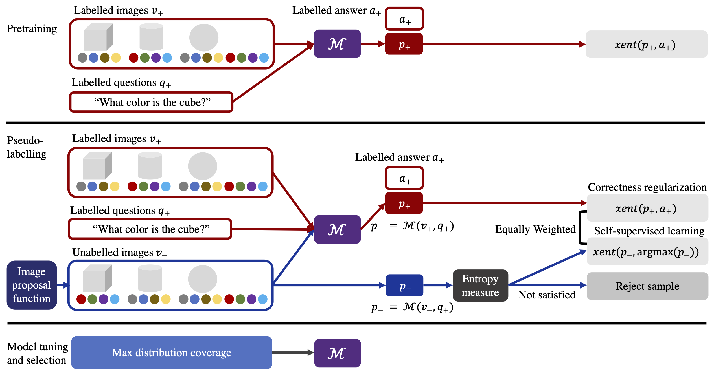

# DisCo: Improving Compositional Generalization in Visual Reasoning through <ins>Dis</ins>tribution <ins>Co</ins>verage



## Setup and Training

This code is based on the FiLM: Visual Reasoning with a General Conditioning Layer [repository](https://github.com/ethanjperez/film). Please refer to the FiLM repository to process CLEVR data in the necessary format, and set the paths of ```train_questions, train_features, test_questions, test_features, vocab```.

Our framework, DisCo, can be found in the disco_scripts folder.  The path to your current run's checkpoints should be set in ```checkpoint_path```. Please first train a base FiLM model, and load in its checkpoint in ```film_checkpoint_path```. We release scripts to run DisCo with two image proposal strategies, direct sampling and GAN generation sampling; for both stategies, the path to the directory of unlabelled images should be at ```real_dataset_dir```.

To run DisCo with direct sampling, run:

```
python disco_scripts/train_sampler.py \
  --entropy_threshold XXX \
  --execution_engine_start_from $film_checkpoint_path \
  --program_generator_start_from $film_checkpoint_path \
  --checkpoint_path $checkpoint_path \
  --model_type FiLMReconContrastiveIntermediate \
  --r1_regularization_gamma 15.0 \
  --train_question_h5 $train_questions \
  --train_features_h5 $train_features \
  --val_question_h5 $test_questions \
  --val_features_h5 $test_features \
  --vocab_json $vocab \
  --real_dataset_dir $real_dataset_dir \
  --num_iterations 20000000 \
  --print_verbose_every 20000000 \
  --checkpoint_every 1000 \
  --record_loss_every 100 \
  --num_val_samples 149991 \
  --optimizer Adam \
  --learning_rate 1e-4 \
  --batch_size 128 \
  --use_coords 1 \
  --module_stem_batchnorm 1 \
  --module_stem_num_layers 1 \
  --module_batchnorm 1 \
  --classifier_batchnorm 1 \
  --bidirectional 0 \
  --decoder_type linear \
  --encoder_type gru \
  --weight_decay 1e-5 \
  --rnn_num_layers 1 \
  --rnn_wordvec_dim 200 \
  --rnn_hidden_dim 4096 \
  --rnn_output_batchnorm 0 \
  --classifier_downsample maxpoolfull \
  --classifier_proj_dim 512 \
  --classifier_fc_dims 1024 \
  --module_input_proj 1 \
  --module_residual 1 \
  --module_dim 128 \
  --module_dropout 0e-2 \
  --module_stem_kernel_size 3 \
  --module_kernel_size 3 \
  --module_batchnorm_affine 0 \
  --module_num_layers 1 \
  --num_modules 4 \
  --condition_pattern 1,1,1,1 \
  --gamma_option linear \
  --gamma_baseline 1 \
  --use_gamma 1 \
  --use_beta 1 \
  --condition_method bn-film \
  --program_generator_parameter_efficient 1

```


To run DisCo with GAN generation sampling, run:

```
python disco_scripts/train_gan_sampler.py \
  --entropy_threshold XXX \
  --execution_engine_start_from $film_checkpoint_path \
  --program_generator_start_from $film_checkpoint_path \
  --stylegan_start_from $stylegan_checkpoint_path \
  --checkpoint_path $checkpoint_path \
  --model_type FiLMReconContrastiveIntermediate \
  --r1_regularization_gamma 15.0 \
  --train_question_h5 $train_questions \
  --train_features_h5 $train_features \
  --val_question_h5 $test_questions \
  --val_features_h5 $test_features \
  --vocab_json $vocab \
  --real_dataset_dir $real_dataset_dir \
  --num_iterations 20000000 \
  --print_verbose_every 20000000 \
  --checkpoint_every 1000 \
  --record_loss_every 100 \
  --num_val_samples 149991 \
  --optimizer Adam \
  --learning_rate 1e-4 \
  --batch_size 8 \
  --use_coords 1 \
  --module_stem_batchnorm 1 \
  --module_stem_num_layers 1 \
  --module_batchnorm 1 \
  --classifier_batchnorm 1 \
  --bidirectional 0 \
  --decoder_type linear \
  --encoder_type gru \
  --weight_decay 1e-5 \
  --rnn_num_layers 1 \
  --rnn_wordvec_dim 200 \
  --rnn_hidden_dim 4096 \
  --rnn_output_batchnorm 0 \
  --classifier_downsample maxpoolfull \
  --classifier_proj_dim 512 \
  --classifier_fc_dims 1024 \
  --module_input_proj 1 \
  --module_residual 1 \
  --module_dim 128 \
  --module_dropout 0e-2 \
  --module_stem_kernel_size 3 \
  --module_kernel_size 3 \
  --module_batchnorm_affine 0 \
  --module_num_layers 1 \
  --num_modules 4 \
  --condition_pattern 1,1,1,1 \
  --gamma_option linear \
  --gamma_baseline 1 \
  --use_gamma 1 \
  --use_beta 1 \
  --condition_method bn-film \
  --program_generator_parameter_efficient 1
```

To pretrain FiLM and StyleGAN2, use ```--training_film``` and ```--training_gan``` respectively in the commands. We use the StyleGAN [repository](https://github.com/NVlabs/stylegan3) as our StyleGAN2 backbone; after pretraining, the StyleGAN2 checkpoint should be set in ```stylegan_checkpoint_path```. 
